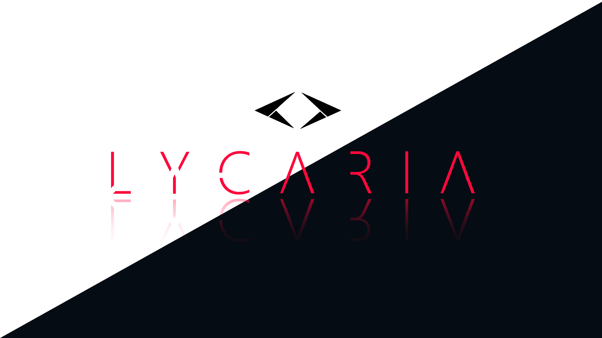

<h1 align="center">
   
    
   
    LYCARIA (GAME) 👁️
   
</h1>

<h4 align="center">An online turn-based game (this repository concerns the game) created with <a href="https://unity.com/pt" target="_blank">Unity</a>. </h4>

  <a href="https://github.com/niloodev/lycaria-project-game/lycaria-art.pdf">ArtBook</a> •
  <a href="#proposal">Proposal</a> •
  <a href="#tools">Tools</a> •
  <a href="#author">Author</a>

  <a href="https://github.com/niloodev/lycaria-project-server">Server</a> •
  <a href="https://github.com/niloodev/lycaria-project-client">Client (Reactron)</a> •
  <a href="https://github.com/niloodev/lycaria-project-game">> Game (Unity) <</a>

> ☕ Developer: [niloodev](https://github.com/niloodev) • 🎨 Lead Designer: [Axel Galzz](https://twitter.com/axelgalzz) • 🐻 Animation and Pixel Designer: [VamnKuma](https://twitter.com/vamnkuma) • 🎵 Soundtrack: [Izábi Ferros](https://www.youtube.com/channel/UCzyddgAW2lqBUp_S6cy8ZJQ)

## Proposal
Project developed by; Ezequiel Nilo (Programming), Axel Galz (Design), VamnKuma (Animation and Pixel ART) and Izábi Ferros (Soundtrack).

Lycaria is a turn-based online game, it is divided in three parts; the client, server and the game. The project was developed with the intention of creating a simple and light form of entertainment for potential players, while developing a complex story behind it.

*The TCC (course conclusion project) was presented and delivered on 06/12/2021 as a project from Analysis and Systems Development technical course in ETEC Antônio de Pádua Cardoso.*

* The game must get the room info from [Lycaria Client](https://github.com/niloodev/lycaria-project-client) and connect to it.
* Have a Load Screen (or Card Screen) to display the character and name of each player in the current match.
* Sync all game info and psychics with [Lycaria Server](https://github.com/niloodev/lycaria-project-server) using Colyseus real-time connection and schemas.
* Have at least one playable map for the matchs, and a minimun of one playable characters (Aegis).

## Tools

This application uses the following open-source packages:

##### Core ones.
- [Unity | Unity 2D](https://unity.com/pt/solutions/2d) (Game development engine)
- [URP | Universal Render Pipeline]() (Is a script that allows some graphic configurations, like [Post Processing](https://www.youtube.com/watch?v=9tjYz6Ab0oc) used in this project)

##### Real-time connection
- [Colyseus (Client)](https://docs.colyseus.io/colyseus/) (Colyseus client, its like a WebSocket client)

## Author
**code made by niloodev | Ezequiel Nilo**

**ANY TIPS OR FEEDBACK IS HIGHLY APPRECIATED! 🐸**

